# AIC2021 Project1 - TPU - vincent08tw
###### tags: `aic2021` 

## Outline
[Project Description](https://github.com/vincent08tw/ai_on_chip_project1/tree/main/AIC2021_TPU_Template-master#project-description)  
[Project directory hierachy](https://github.com/vincent08tw/ai_on_chip_project1/tree/main/AIC2021_TPU_Template-master#project-directory-hierachy)  
[Testbench1~3 and monster (Use ModelSim)](https://github.com/vincent08tw/ai_on_chip_project1/tree/main/AIC2021_TPU_Template-master#testbench13-and-monster-use-modelsim)  
[Support (MxK) * (KxN)](https://github.com/vincent08tw/ai_on_chip_project1/tree/main/AIC2021_TPU_Template-master#support-mxk--kxn)  
[Synthesis (Use Design Compiler)](https://github.com/vincent08tw/ai_on_chip_project1/tree/main/AIC2021_TPU_Template-master#synthesis-use-design-compiler)  
[TPU architecture graph](https://github.com/vincent08tw/ai_on_chip_project1/tree/main/AIC2021_TPU_Template-master#tpu-architecture-graph)  
[State definition](https://github.com/vincent08tw/ai_on_chip_project1/tree/main/AIC2021_TPU_Template-master#state-definition)  
[Explain the dataflow in my TPU design ((4x7) * (7x3))](https://github.com/vincent08tw/ai_on_chip_project1/tree/main/AIC2021_TPU_Template-master#explain-the-dataflow-in-my-tpu-design-4x7--7x3)  
[Explain how to compute (MxK) * (KxN) with my TPU design ((4x7) * (7x3))](https://github.com/vincent08tw/ai_on_chip_project1/tree/main/AIC2021_TPU_Template-master#explain-how-to-compute-mxk--kxn-with-my-tpu-design-4x7--7x3)  
[TOP Simulation Achitecture](https://github.com/vincent08tw/ai_on_chip_project1/tree/main/AIC2021_TPU_Template-master#top-simulation-achitecture)  
[Testbench](https://github.com/vincent08tw/ai_on_chip_project1/tree/main/AIC2021_TPU_Template-master#testbench)  


## Project Description
This project use weight stationary method.  
Design a Tensor Processing Unit(TPU) which has **4x4** Processing elements(PEs) that is capable to calculate ```(4*K)*(K*4)``` 8-bit integer matrix muplication. (Where is ```K``` is limited by the size of input global buffer)  
* Property  
	* Support ```(M*K)*(K*N)```
	* Synthesizable  
	* Weight stationary  

## Project directory hierachy
```
AIC2021_TPU/
    +-- tb/
    |   +-- matmul.py
    |   +-- top_tb.v
    +-- src/
    |   +-- define.v
    |   +-- global_buffer.v
    |   +-- top.v
	|   +-- pe.v
	|   +-- TPU.v	
    |
    Makefile
```

## Testbench1~3 and monster (Use ModelSim)
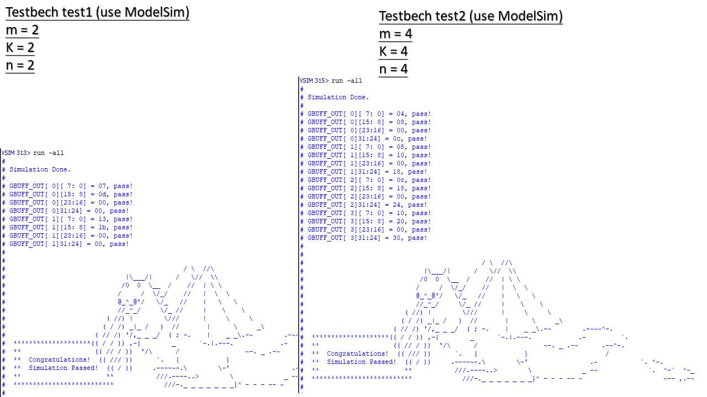
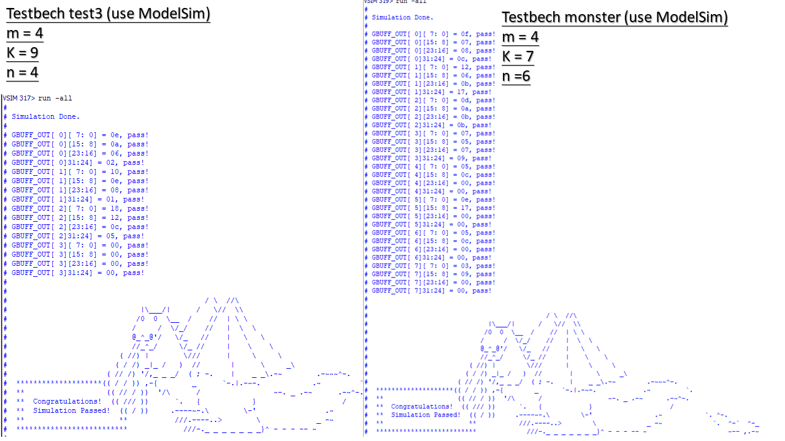

## Support (MxK) * (KxN) 
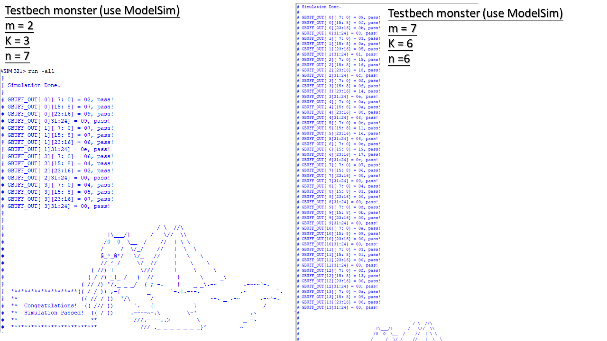
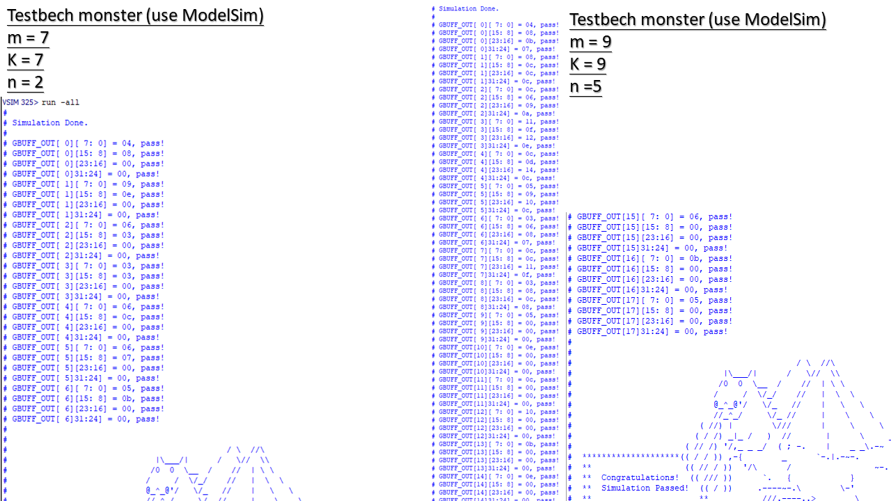

## Synthesis (Use Design Compiler)
* Area Report  

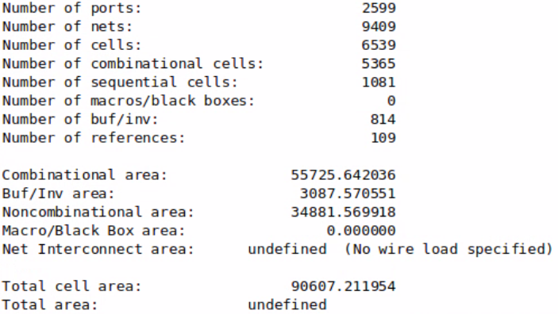

* Timing Report  

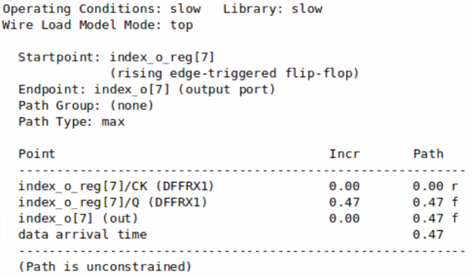

## TPU architecture graph
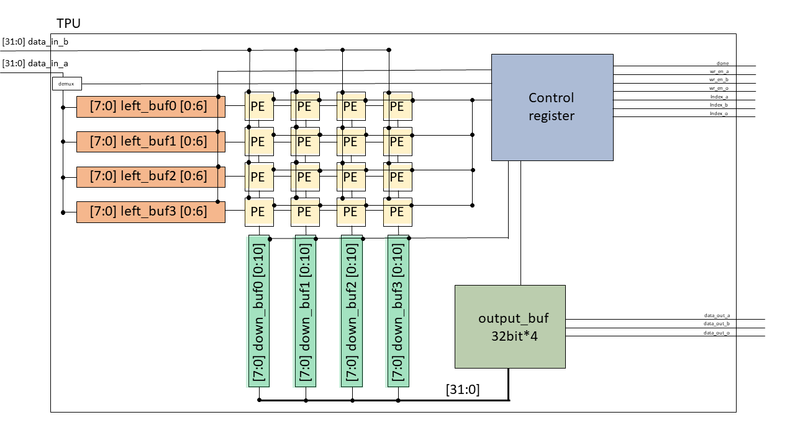
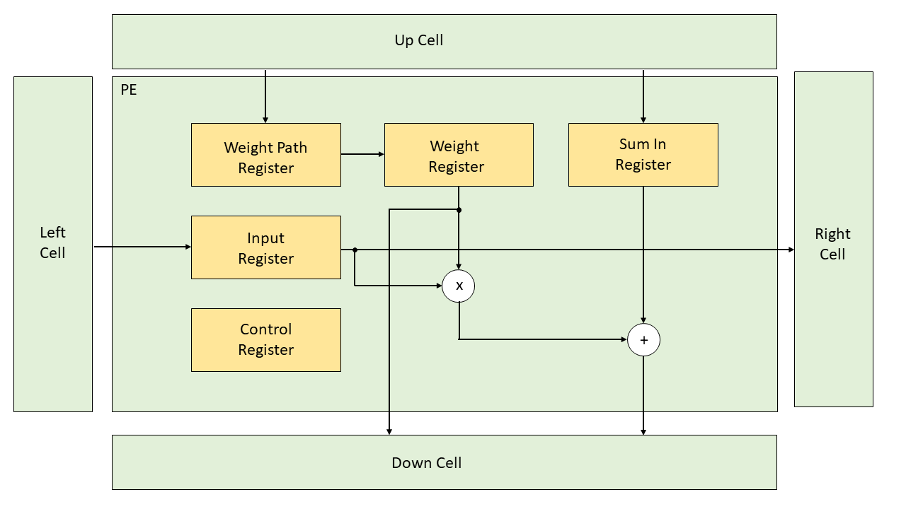

## State definition
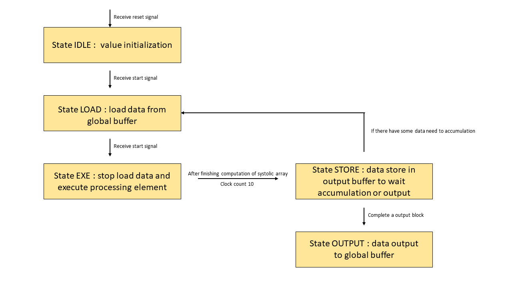

## Explain the dataflow in my TPU design ((4x7) * (7x3))
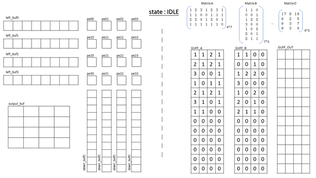


## Explain how to compute (MxK) * (KxN) with my TPU design ((4x7) * (7x3))
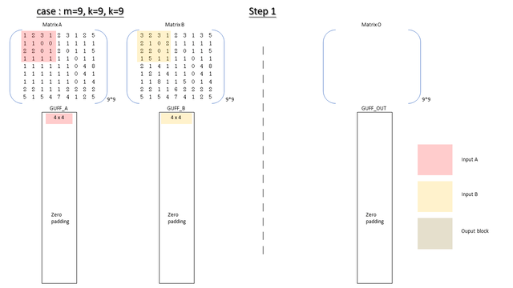

## TOP Simulation Achitecture


## Testbench


**Makefile**
* ```make test1```
    * ```A(2*2)*B(2*2)```
* ```make test2```
    * ```A(4*4)*B(4*4)```
* ```make test3```
    * ```A(4*K)*B(K*4)```, where ```K=9```
* ```make monster``` (extra)
    * ```A(M*K)*B(K*N)```, where ```K<10```, ```M<10```, ```N<10```
    * Although our target is ```(4*K)*(K*4)``` matrix multiplication, when ```M``` & ```N``` is small enough to fit in the input global buffers, give a solution for that size of input matrices. :smile:
* ```make clean```
    * This will remove the ```build/``` folder 

**Global buffer mapping**
```
build/
    +-- matrix_a.bin
    +-- matrix_b.bin
    +-- golden.bin
```
* Memory Mapping - Type A (with transpose)

* Memory Mapping - Type B (Without transpose)


